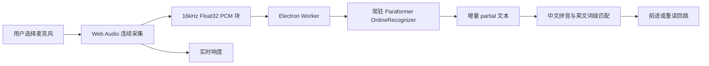

# FunASR 本地识别引擎

## 目标

在不上传音频和转写文本的前提下，为 AI 跟随提供可替代系统识别的本地 ASR。跟稿匹配、重读回跳和显示控制继续使用应用现有逻辑，识别引擎只负责输出文本。

实时跟稿不要求生成最终正确字幕，也不执行句末二次校正。目标链路改为流式增量文本、中文拼音音节对齐和稳定字符锚点；同音字可以视为已经读到。

桌面跟稿仅保留流式 Paraformer：默认使用 `Paraformer Streaming INT8`，可选 FP32 精度版。SenseVoiceSmall 整段识别已从产品入口和安装资源中删除；Qwen3-ASR-0.6B 仅作为后续高性能桌面预选，详细评估见 `docs/research/asr-candidate-evaluation.md`。

## 模型库

- 默认 ASR：FunASR Streaming Paraformer 中英双语 INT8 ONNX，编码器、解码器和 tokens 合计约 226MiB。
- Runtime：`sherpa-onnx-node 1.13.3`，Electron Worker 内常驻 `OnlineRecognizer`。
- 可选 ASR：Paraformer Streaming FP32，约 825 MiB，内存占用更高。
- VAD：FSMN-VAD GGUF，约 1.7MB。
- 兼容 Runtime：FunASR `runtime-llamacpp-v0.2.0`。
- 每个模型及其所有文件都定义版本、字节数和 SHA-256；下载支持 `.download` 断点续传，完成后同时验证大小与哈希。
- macOS ARM64 runtime 随应用打包并在复制前校验 SHA-256；模型安装在 Electron `userData/funasr/`，不进入应用安装包。

q8 与 f16 在官方中文 CER 测试中基本持平，因此 f16 不标记为“高精度”；它是排查量化兼容性的备选档。Fun-ASR-Nano q4 需要约 470MB 编码器和 484MB 解码器，不作为默认端侧模型。

## 模型管理

- 快速设置可直接切换已安装模型，切换时停止当前采集和推理，检查新模型后再恢复 AI 跟随。
- 模型管理器统一显示安装状态、文件大小、可用版本、下载进度和错误，支持下载、更新、切换、删除与打开模型目录。
- 当前正在使用的模型不允许删除；下载中的模型不允许并发删除。
- manifest 版本低于当前注册版本时标记为可更新；当前版本的大小或哈希不匹配则标记为文件损坏。更新会重新下载并以完整文件替换旧文件。
- 下载源按可配置 Hugging Face endpoint、官方源和镜像源依次尝试；无论使用哪个源，最终都必须通过注册哈希验证。

## 当前数据流

控制台使用 `enumerateDevices` 列出输入设备，用户选择的 `deviceId` 持久化保存。切换设备时停止旧 MediaStream 和 Worker，再以 `deviceId: { exact: ... }` 打开新输入；设备断开时保留原选择并在界面明确标记。首次授权后重新枚举，以取得 macOS 隐藏到授权后的真实设备名称。

音频以 2048 帧块送入 Worker，Worker 保留 Paraformer 跨块 cache，partial 变化时立即输出。端点检测仅负责重置识别流，不执行二次字幕校正。暂停、切换模型、切换麦克风或离开 AI 模式会停止 MediaStream 并终止 Worker，使迟到结果失效。

## 后端选择

| 平台 | 自动策略 | 手动后端 | 当前状态 |
| --- | --- | --- | --- |
| macOS arm64 | CPU | CPU | Paraformer 流式链路已实测 |
| Windows x64 | CPU | CPU | 相同 Electron/Web Audio/Worker 代码已接入，待 Windows 真机 |
| Android | 系统端侧识别 | 系统语言包 | Capacitor 与 API 31+ 端侧识别已编译；FunASR JNI 未实现 |

Paraformer Streaming 的当前 sherpa-onnx Node 配置固定使用 CPU，因此界面禁用后端选择，不能把它显示成 GPU 推理。

Windows CUDA 官方预编译包只覆盖特定 CUDA 架构，自动模式不盲选 CUDA。Vulkan 依赖系统驱动；启动失败时产品实现需要回退 CPU 并记录完整诊断。

## 已知限制

- macOS 与 Windows 共用的 Node native addon 必须跟 Electron ABI 和目标架构一起打包；当前锁定 `1.13.3` 并将 native 文件解包出 ASAR。
- Paraformer 模型不提供时间戳，位置完全由稿件对齐层决定。
- 英文按单词匹配，中文同音字按无声调拼音匹配；初次定位仍要求多个音节，锁定后允许单音节前进。
- 重读回跳扩大后向搜索窗口并要求确认，避免一次短 partial 引起大幅误跳。
- Android 尚未接入 sherpa-onnx JNI，不能复用 Electron Worker。

## 移动端迁移边界

- 不复用 Electron 子进程和桌面安装器。
- 复用识别事件协议：`level`、`transcript`、状态、耗时和错误。
- Android 需要 NDK/JNI 封装，并按 ABI 分发 runtime。
- 移动端默认模型需要以真实设备上的内存、温升、首段延迟和持续实时率决定，不能只按桌面 CPU 结果选择。

## 验收门槛

- 断网后可持续识别。
- 连续音频只在内存中的 MediaStream、AudioBuffer 和 Worker 消息中流转。
- 暂停后 200ms 内停止采集，正在推理的进程被终止。
- 连续朗读、停顿、短句、噪声和重读均不造成未消费 PCM 块无限增长。
- 真实设备记录 partial 间隔、Worker 解码耗时、待处理块数、后端与错误类型。

## macOS 实测基线

Paraformer 官方 10.05 秒中英混合音频在当前 Apple Silicon Mac 上输出 12 次 partial，首个“昨”在输入音频 1.2 秒处出现，完整音频离线喂入总耗时为冷启动 771ms、热缓存 318ms。Electron 完整链路使用同一音频得到 4 次可观察 partial，在“昨天是 monday”时已经把锚点推进到第 10 个字符，Worker 最近一次解码耗时 32ms；关闭麦克风后状态进入 `paused` 且响度归零。

在当前 Apple Silicon Mac 上，SenseVoiceSmall q8 对 5.87 秒、16kHz、单声道中文 WAV 的识别耗时为 0.15 秒；包含 CLI 启动和模型加载的端到端耗时为 0.71 秒。输出为“这是本地语音识别测试提词器应该根据朗读内容自动跟随”，与测试文本一致。

Electron 开发态完整链路约 185ms，未签名本地开发 `.app` 的打包态完整链路约 627ms，两者匹配置信度均为 1.0。这里的 `.app` 仅用于功能验收；Developer ID 分发签名与公证不属于本轮完成项。

F16 模型管理闭环已使用真实 16kHz 中文 WAV 验证：下载后 SHA-256 一致，切换后推理耗时约 943ms，跟稿匹配置信度 1.0；验收后切回 Q8 并删除 F16，本地状态恢复为未安装。
